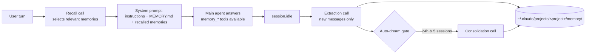

<div align="center">

# 🧠 Claude Code-compatible memory for OpenCode

**Persistent, local-first shared memory for OpenCode and Claude Code - one plugin, zero migration.**

This OpenCode plugin lets OpenCode read and write Claude Code-compatible Markdown memory files, so both CLIs share the same project context.

Claude Code writes memory → OpenCode reads it. OpenCode writes memory → Claude Code reads it.

[](https://www.npmjs.com/package/opencode-claude-memory)
[](https://www.npmjs.com/package/opencode-claude-memory)
[](https://github.com/kuitos/opencode-claude-memory/blob/main/LICENSE)

[Quick Start](#-quick-start) • [How it works](#-how-it-works) • [Configuration](#-configuration) • [Compatibility](#-compatibility-with-claude-code) • [Migrating from v1](#-migrating-from-v1) • [FAQ](#-faq)

</div>

---

## About this fork

This is a fork of [kuitos/opencode-claude-memory](https://github.com/kuitos/opencode-claude-memory) for folders that other tools also write to, such as [dsh-unified-memory](https://github.com/mattcarvercom/dsh-unified-memory) or Claude Code itself. Upstream rewrites a memory's whole file on every save, which drops any frontmatter it does not know, including other tools' provenance. This fork:

- **Keeps what it does not own.** Saving an existing memory changes only its name, description, type, `modified` and body; every other frontmatter line, including another tool's `metadata.origin`, is kept byte for byte.
- **Records provenance.** Files it creates carry `metadata.origin: opencode` and `metadata.modified`; edits to files another tool created add `metadata.updatedBy: opencode`.
- **Keeps a copy of other tools' memories it deletes.** Deleting a memory it did not create (for example during auto-dream consolidation) first copies it to `$CLAUDE_CONFIG_DIR/opencode-memory/<project>/trash/<timestamp>/`.
- **Writes atomically.** Memory files and `MEMORY.md` are written to a temporary file and renamed into place.
- **Quotes YAML values that need it,** and reads quoted values back correctly.

- **Targets OpenCode 2.** OpenCode 2 replaced the plugin API, so `main` is a port to it (`Plugin.define`, JSON-schema tools, the `context` session hook, `ctx.generate.text`). The OpenCode 1 version of this fork is kept on the `opencode-1` branch; upstream itself still targets OpenCode 1.

The fork is not published to npm, so it is installed from a clone (see [Quick Start](#-quick-start)).

## ✨ At a glance

- **Memory tools** - `memory_save` / `memory_delete` / `memory_list` / `memory_search` / `memory_read`, plus the Claude Code memory instructions injected into every system prompt.
- **LLM recall** - before each turn a small model call picks the memories relevant to the query; they appear in the *first* LLM call, including single-step questions.
- **Automatic extraction** - after a session goes idle, a model call reviews only the *new* part of the conversation and the plugin saves what is worth keeping.
- **Auto-dream** - periodic consolidation (merge / prune / rewrite) gated on time and session count, like Claude Code, with a backup of the memory directory before every pass.
- **Claude Code-compatible** - same directory, same file format, same taxonomy, same worktree handling. `MEMORY.md` is edited line by line so hand-organised indexes stay intact.
- **Cross-platform, no shell hook** - everything runs inside the OpenCode process through the plugin SDK. No `python3`, no `jq`, no wrapper.
- **Nothing left behind** - background work uses stateless `ctx.generate.text` calls, so it never creates sessions in your session list.

## 🚀 Quick Start

Requires OpenCode **≥ 2.0**, [Bun](https://bun.sh) and git.

```bash
curl -fsSL https://raw.githubusercontent.com/mattcarvercom/opencode-claude-memory/main/scripts/install.sh | bash
```

The script clones the fork into `~/.local/share/opencode-claude-memory` (`--dir` to change it), builds it, and points your global opencode config at the checkout with a `file://` entry in `plugins`, replacing any `opencode-claude-memory` entry (also one in the OpenCode 1 `plugin` list) and keeping its options. Run it again to update. `--config FILE` edits another config file, and `--no-config` leaves configuration to you; when piping, pass options after `bash -s --`, as in `... | bash -s -- --no-config`. A config file with comments is edited only where the plugin's name appears; if there is none to replace, the script prints the line to add.

To do the same by hand:

```bash
git clone https://github.com/mattcarvercom/opencode-claude-memory ~/.local/share/opencode-claude-memory
cd ~/.local/share/opencode-claude-memory && bun install && bun run build
```

```jsonc
// ~/.config/opencode/opencode.json (global)
{
  "plugins": [
    {
      "package": "file:///home/you/.local/share/opencode-claude-memory",
      "options": { "model": "provider/model" }
    }
  ]
}
```

OpenCode 2 loads a plugin directory through its root `index.js`, which re-exports the build in `dist/`. After pulling changes, run `bun install && bun run build` again (`dist/` is not committed), then `opencode service restart` or restart opencode.

**Set `model`.** The plugin's background calls (recall, extraction, auto-dream) are plain model calls outside any session. Without `model` they use OpenCode's default model, which fails when that is one of the free models that only work inside a session. Pick a small, cheap model you have a key for, for example `deepseek/deepseek-flash`.

Memories live in `~/.claude/projects/<project>/memory/` (or under `$CLAUDE_CONFIG_DIR`), exactly where Claude Code keeps them.

## ⚙️ How it works



1. **Recall** - the `context` session hook runs before every model call. On the first call of a user turn it starts a selector (one `ctx.generate.text` call over the memory manifest) and waits for it up to `recall.waitMs` (default 1.5 s), then appends the selected memories to the system prompt. Later calls of the same turn reuse the result. If the selector is slower than `waitMs`, its result appears from the next call on.
2. **Extraction** - every `session.idle` (and finished execution) is debounced (`extract.debounceMs`). The plugin reads the session's messages, slices them after the per-session watermark and, only if there is a new user message, asks the model for memories worth keeping as a JSON list. The plugin validates the list and writes the files itself; extraction only creates memories and never overwrites an existing one. On success the watermark advances; if the main agent already saved memory in that stretch the call is skipped. Only top-level sessions of the plugin's own directory are extracted.
3. **Auto-dream** - after each extracted session the gate is evaluated (`autodream.minHours` since the last pass **and** `autodream.minSessions` extracted since). When it passes, the model gets every memory in full and answers with files to save and files to delete. The memory directory is copied to `<state>/dream-backups/` first (newest 3 kept), deleting more than half of the memories in one pass is refused, and memories another tool created are copied to the trash before deletion. A lock file prevents two OpenCode processes from consolidating at once.
4. **Ignore memory** - "ignore memory" in a user message switches memory off for the rest of the session (no index, no recall); "use memory again" switches it back on.

State that is private to the plugin (watermarks, auto-dream gate, lock, backups, trash, `plugin.log`) lives in `<CLAUDE_CONFIG_DIR>/opencode-memory/<project>/`, never inside the Claude Code project directory.

## 🔧 Configuration

All behaviour is configured through OpenCode's own configuration. There are no `OPENCODE_MEMORY_*` environment variables.

```jsonc
// opencode.json
{
  "plugins": [
    {
      "package": "file:///home/you/.local/share/opencode-claude-memory",
      "options": {
        "model": "deepseek/deepseek-flash",
        "extract":   { "enabled": true, "timeoutMs": 120000, "debounceMs": 10000, "maxConversationChars": 60000 },
        "autodream": { "enabled": true, "minHours": 24, "minSessions": 5, "timeoutMs": 300000, "model": "deepseek/deepseek-pro" },
        "recall":    { "enabled": true, "waitMs": 1500, "timeoutMs": 30000, "maxMemories": 5 }
      }
    }
  ]
}
```

- Every option is optional; the numbers shown are the defaults. Unknown keys are rejected when the plugin loads.
- `model` (`provider/model`, the spelling `opencode run --model` takes) is used for all three background tasks; `extract.model`, `autodream.model` and `recall.model` override it per task. Without any of them OpenCode's default model is used.
- `CLAUDE_CONFIG_DIR` is honoured exactly like Claude Code does, and is the only environment variable the plugin reads.

OpenCode 2 gives plugins no log channel, so the plugin writes its own JSON-lines log to `<CLAUDE_CONFIG_DIR>/opencode-memory/<project>/plugin.log` (truncated at 512 KB). Failed extractions and consolidations are logged there.

## 🤝 Compatibility with Claude Code

| Aspect | Claude Code | This plugin |
|---|---|---|
| Memory directory | `~/.claude/projects/<sanitized canonical git root>/memory/` | identical (`sanitizePath`, worktree → main repo resolution ported byte for byte) |
| File format | Markdown + `name` / `description` / `type` frontmatter | identical; frontmatter parsed only within the first 30 lines, as in Claude Code |
| Taxonomy | `user`, `feedback`, `project`, `reference` | identical |
| `MEMORY.md` | one-line pointers, hand-organisable | read with the same truncation rules; written with minimal line-level edits |
| Sub-directories | `team/x.md` etc. | scanned, recalled and addressable from every tool |
| System prompt | memory instructions + index + recalled memories | ported sections (`memoryTypes.ts`, `memdir.ts`) |
| Recall | LLM side query | LLM side query as a stateless model call (`findRelevantMemories.ts` port) |
| Extraction / auto-dream | after session, gated | after `session.idle`, gated the same way |

Memory files written by either tool need no conversion in either direction.

## 📝 Memory format

```markdown
---
name: User prefers terse responses
description: User wants concise answers without trailing summaries
type: feedback
---

Skip post-action summaries. User reads diffs directly.

**Why:** User explicitly requested terse output style.
**How to apply:** Don't summarize changes at the end of responses.
```

## 🔁 Moving from OpenCode 1

OpenCode 2 does not run OpenCode 1 plugins, so this fork's `main` replaces the OpenCode 1 build. Memory files are untouched and need no conversion.

- **Config:** `plugin` becomes `plugins`, and `["name", { options }]` becomes `{ "package": "name", "options": { ... } }`. OpenCode 2 still reads the old `plugin` key, and the install script moves the entry for you.
- **Agents are gone.** The three hidden `opencode-memory-*` agents (and their `agent.*` overrides) no longer exist; set `model`, `recall.model`, `extract.model` or `autodream.model` instead.
- **Extraction only creates.** It no longer re-saves an existing memory with merged content; updating existing memories is left to the agent and to auto-dream.
- **No start-up catch-up.** `extract.catchUpLimit` is removed. OpenCode 2 keeps a background server running after the terminal closes, so the debounce timer survives quitting.
- **Recalled memories are not de-duplicated across turns.** The system prompt is rebuilt for every model call, so a relevant memory is selected again on a later turn.

Stay on OpenCode 1? Use the `opencode-1` branch of this fork, or [upstream](https://github.com/kuitos/opencode-claude-memory). The even older shell-hook version is documented in the [v1 README](https://github.com/kuitos/opencode-claude-memory/blob/v1.7.7/README.md).

## ❓ FAQ

**Is this a new memory system?** No. It is a compatibility layer around Claude Code's memory layout and conventions.

**Do I need to migrate existing memory?** No. Existing Claude Code memory files are used as they are.

**Where is data stored?** `~/.claude/projects/<project>/memory/` (or `$CLAUDE_CONFIG_DIR/projects/...`). Plugin state lives in `$CLAUDE_CONFIG_DIR/opencode-memory/<project>/`. Memories the plugin deletes but did not create (Claude Code's, or another tool's) are copied to `trash/<timestamp>/` there first.

**Can I disable extraction, auto-dream or recall?** Yes - `extract.enabled`, `autodream.enabled`, `recall.enabled` in the plugin options.

**Why did my first answer take a moment longer?** The system prompt waits up to `recall.waitMs` for the selector. Set it to `0` to never wait (recalled memories then appear from the second LLM call of a turn onwards).

**Does extraction see my whole conversation?** Only the messages after the last extraction, capped at `extract.maxConversationChars` (newest first). The model cannot call tools or touch files; it returns a list and the plugin validates and writes it.

**Recall, extraction or auto-dream never seem to run.** Check `plugin.log` (see Configuration). The usual cause is a default model that cannot be called outside a session; set `model`.

## 🧪 Development

```bash
bun install
bun test            # unit, integration and eval tests
bun run evals       # readable task-eval report
bun run lint        # biome
bun run typecheck
bun run build       # emits dist/
```

Upstream cuts releases with semantic-release on push to `main`; that workflow is disabled in this fork, which is not published to npm.

## 📄 License

[MIT](LICENSE) © [kuitos](https://github.com/kuitos)
